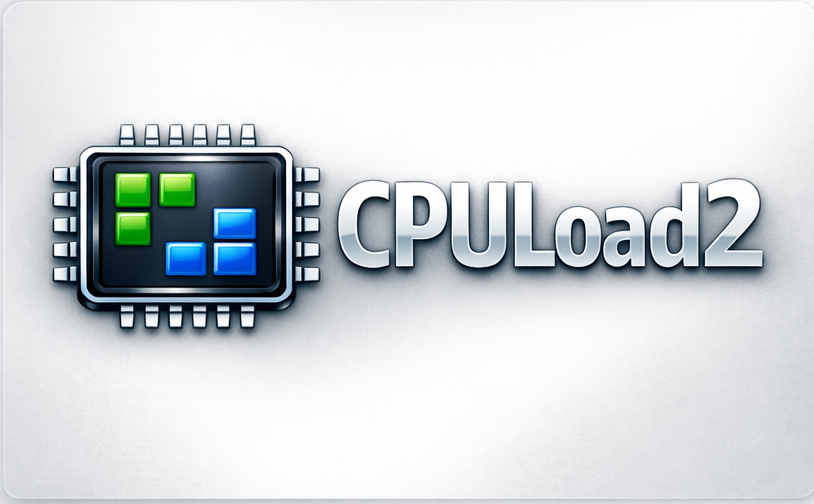

  

  

# CPULoad2

CPULoad2 helps you find the best moment to start a game on an older PC — when the CPU is truly idle.  
It displays real‑time CPU usage directly in the Windows system tray, so you can see exactly when background processes finish after startup.

---

## Features
- Real‑time CPU load indicator in the system tray  
- Reads CPU usage directly from Windows Task Manager  
- Helps determine the ideal moment to launch games or heavy applications  
- Lightweight and minimal resource usage  
- Auto‑start option  
- Custom tray icon  

---

## Installation
1. Download the latest release from the **Download** button above.  
2. Extract the ZIP file.  
3. Run `CPULoad2.exe`.  
4. (Optional) Disable or Enable autostart in the tray menu.

---

## How it works
The app periodically reads CPU usage from Windows Task Manager APIs and updates the tray icon with the current load percentage.  
This allows you to visually see when your system is busy or idle.

---

## Known issues
This is the first version, so the program may occasionally crash.  
If it does, simply launch it again from the desktop icon.

---

## License
This project is licensed under the MIT License.
